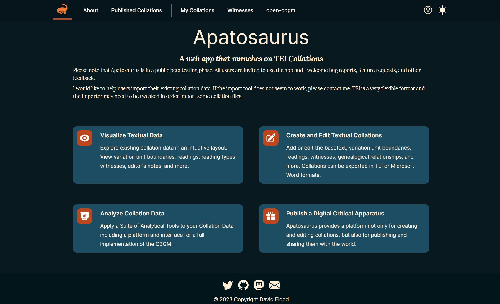

Copyright (C) 2023  David Flood

    This program is free software: you can redistribute it and/or modify
    it under the terms of the GNU General Public License as published by
    the Free Software Foundation, either version 3 of the License, or
    (at your option) any later version.

    This program is distributed in the hope that it will be useful,
    but WITHOUT ANY WARRANTY; without even the implied warranty of
    MERCHANTABILITY or FITNESS FOR A PARTICULAR PURPOSE.  See the
    GNU General Public License for more details.

    You should have received a copy of the GNU General Public License
    along with this program.  If not, see <https://www.gnu.org/licenses/>.

# Apatosaurus

Apatosaurus is live at [apatosaurus.io](https://www.apatosaurus.io)

See [About your data](https://www.apatosaurus.io/about) for the recommended setup and data-ownership model.



This is the open source rewrite of [Apparatus Explorer](https://www.apparatusexplorer.com/).

This new version is more than an explorer. Its features include

- visualization
- editing
- publishing
- analysis tools
- CBGM via `open-cbgm`
- and as many modules from [Criticus](https://github.com/d-flood/criticus/) as make sense to bring to a web app.

## Development

Apatosaurus is now a frontend-only SvelteKit app. The legacy Django backend and bundled reverse-proxy deployment have been removed.

The persistence architecture is documented in
[`.tracker/files-as-database/architecture.md`](.tracker/files-as-database/architecture.md). A project is a
folder of versioned, hash-validated documents in the browser's Origin Private File System (OPFS); SQLite is
only a disposable index rebuilt from those files.

Install dependencies from the repository root or from `app/` with the full monorepo checked out:

```sh
pnpm install
```

Start the development server from `app/`:

```sh
pnpm run dev
```

See `app/README.md` for app-specific setup and quality gates.

When the derived SQLite schema changes, edit the current schema, regenerate its types, and increment
`INDEX_SCHEMA_VERSION` in `app/src/lib/client/db/schema-version.generated.ts`. Do not add a migration that
deletes the user's current database: the new versioned index is rebuilt from canonical project files, and
the old index is removed only after rebuild.

## Production

The app builds as static SvelteKit output and is deployed by the GitHub Pages workflow in `.github/workflows/app-pages.yml`.
